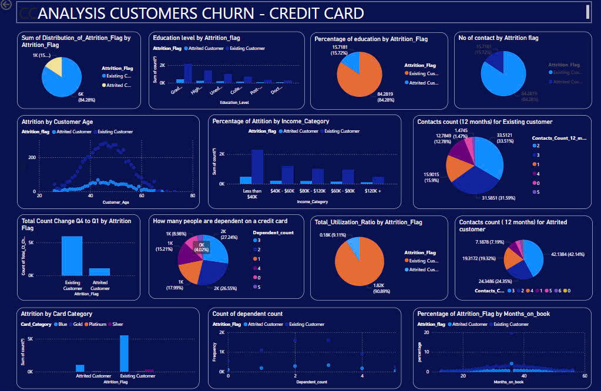

# ANALYSIS CURTOMERS CHURN - CREDIT CARD

## Business context:

In the banking sector, customer retention is a critical aspect of sustaining profitability and growth,
espectical for services that rely on recurring use, such as credit cards. The dataset for this project represents a financial institution
dealing with increasing customer churn, which impacts the bank’s revenue and reputation. This project aims to analyze the reasons why customers discontinue the company's services. From there, it will develop appropriate strategies for the future.

## Objective:

- Analyze which factors affect the churn rate of bank customers.
- Provide actionable insights for bank to reduce churn rate and improve its business

## PROCESS

### 1. Colect data :

Dataset(Kaggle): https://www.kaggle.com/datasets/sakshigoyal7/credit-card-customers?resource=download

### 2. Clean datadata:

- Delete unnecessary columns
- Remove duplicates
- Standardize the Data
- Delete Null values or blank values

### 3. Analyzing the data

- Calculate counts for each catefgory of Attrition_Flag
- Percentage of Attrition by Gender
- Percentage of Attrition by Income Category
- Attrition Percentage By customer\_\_Age
- Attrition Percentage By Card Category
- how many people are dependent on a credit Card
- Marital_status, count(\*), percentage, total_count, Percenatage Marital_status
- Months_on_book, count(\*), percentage, total_count, Percenatage Months_on_book
- Percentage of Attrition by Education_Level
- Total Transaction Count (Last 12 months)
- Change in Transaction Count (Q4 over Q1)
- Calculate the sum of Total_Ct_Chng_Q4_Q1for each category of Attrition_Flag
- Total Revolving Balance on the Credit Card
- Calculate the sum of Total_Ct_Chng_Q4_Q1for each category of Attrition_Flag
- Total Revolving Balance on the Credit Card
- Calculate the sum of Total_Revolving_Bal for each category of Attrition_Flag
- No. of Contacts in the last 12 months (contacts_count_12_mon)
- Calculate the sum of Contacts_Count_12_mon for each category of Attrition_Flag: Existing Custome, Attrited Customer
- Average Card Utilization Ratio by Attrition flag
- total Avg_Utilization_Ratio by Attrition Attrition_Flag

### 4. Data visualization

### 5. Insight

- From the cleaned data, it shows that the customer churn rate accounts for 15.7%
- It can be observed that customers who churned had a higher number of contacts with the bank compared to those who continued using the service. This could be due to disputes that required assistance for resolution or questions that needed to be addressed by customer service
- Additionally, we can observe that the majority of customers fall within the age range of 36 to 56. Moreover, a significant portion of customers predominantly use the bank's 'Blue' card. Month on book of an account is distributed almost normally, except for a significant spike at the age of 36, after which it gradually decreases.

#### Recommendation: Based on the data, we recognize the need to reduce the number of disputes related to our products to enhance customer retention. To achieve this goal, specific actions should focus on thoroughly addressing customer inquiries as soon as they reach out and improving the efficiency of the customer service department by optimizing processes and increasing productivity
